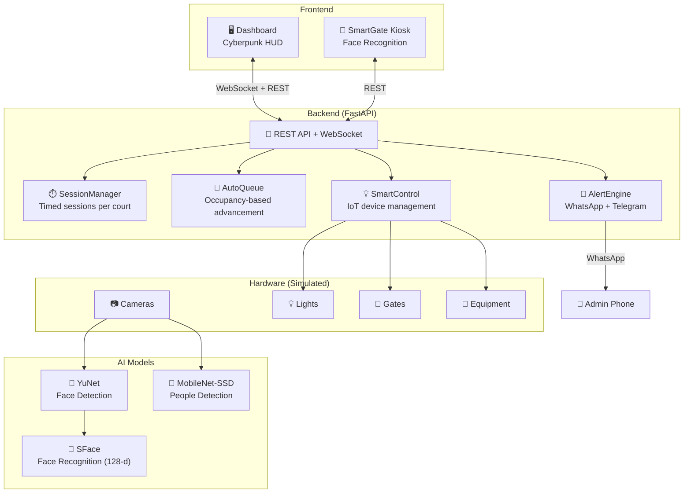
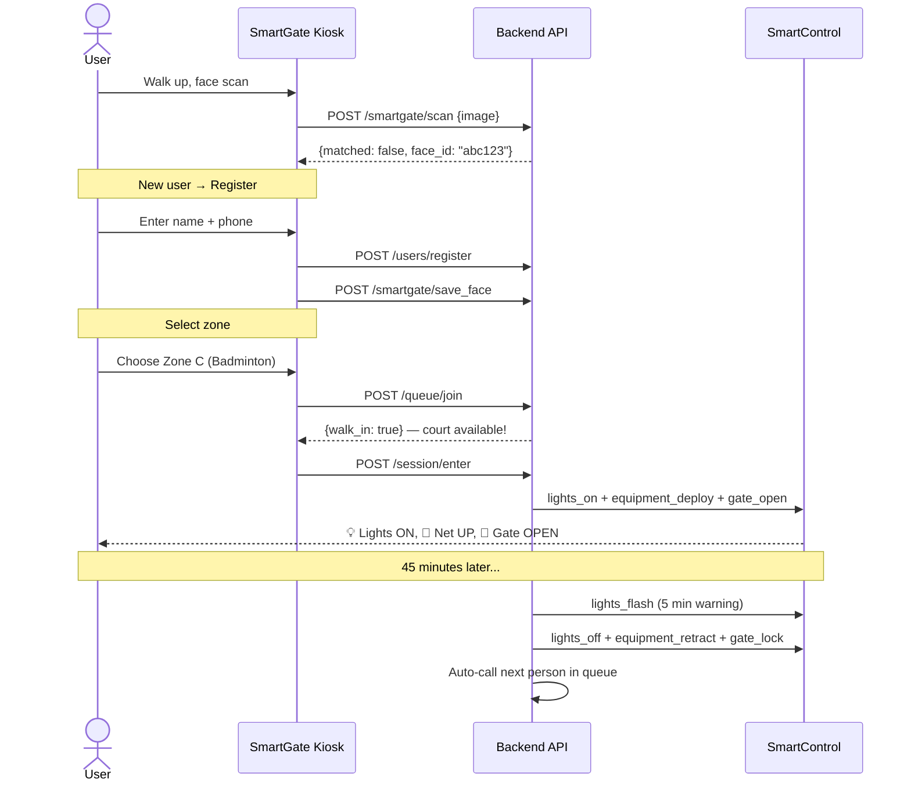
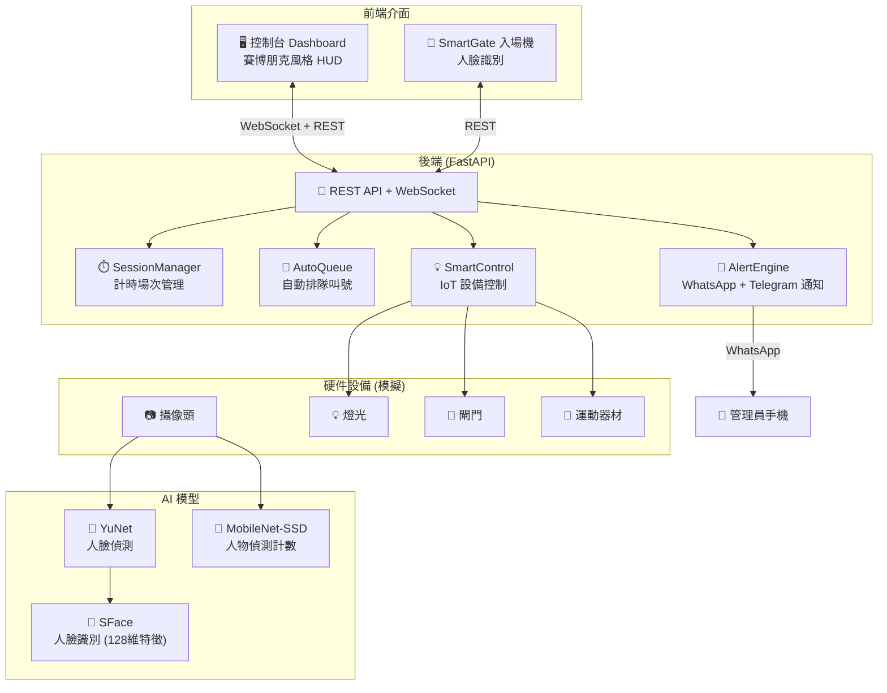
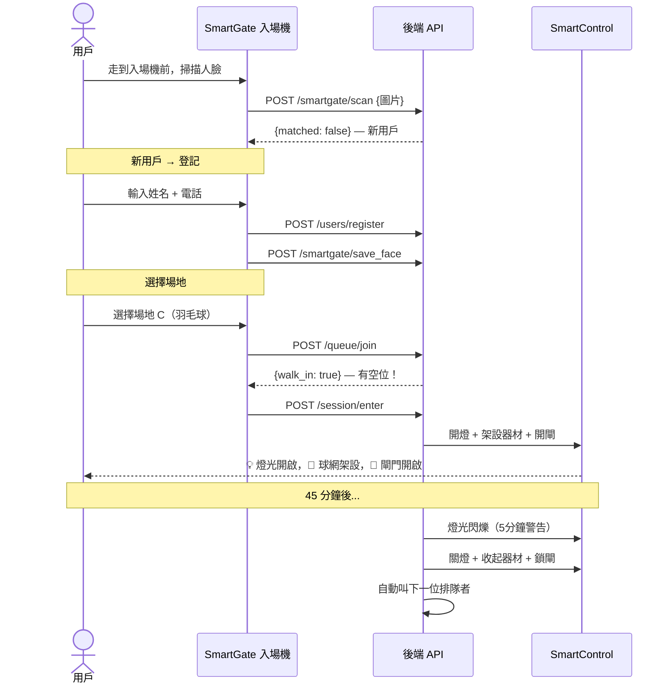
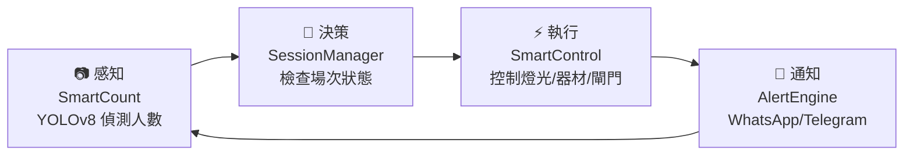

<p align="center">
  
  
  
  
  
</p>

<h1 align="center">
  🏟️ BridgeSpace<br>
  <sub>橋底智能社區運動中心</sub>
</h1>

<p align="center">
  <b>COM1002 Cyber Technology and Society — Group 5, Topic 1</b><br>
  The Hang Seng University of Hong Kong · Final Exhibition: 18 April 2026
</p>

<p align="center">
  <a href="#english">English</a> · <a href="#中文">中文</a>
</p>

---

<a id="english"></a>

# 🇬🇧 English

## What is BridgeSpace?

BridgeSpace transforms **idle space under Sha Lek Highway (沙瀝公路), Sha Tin** into an AI-powered, fully unmanned community sports hub.

**Core principle:** No advance booking — walk-in only. You must be physically present at the kiosk to play. This prevents court scalping (炒場) and ensures fair access for the community.

### Key Numbers

| Metric | Value |
|--------|-------|
| Location | Under Sha Lek Highway, Sha Tin (288m × 14m × 5m) |
| Zones | **10** flexible multi-sport zones (A–J) |
| Unit system | Each zone = **4 units** of space |
| Court area | 10 × 4 × 24.5㎡ = **980㎡** |
| Total area (with circulation) | **≈ 1,274㎡** (31% of bridge space) |
| Sports | 🏓 Table Tennis · 🏸 Badminton · 🏓 Pickleball · 🏀 Basketball · 🏐 Volleyball |

---

## System Architecture



---

## Unit-Based Zone System

Every zone has **4 units** of space. Sports can be mixed within a single zone:

| Sport | Units | Duration | Equipment |
|-------|-------|----------|-----------|
| 🏓 Table Tennis (乒乓球) | **1** unit | 30 min | Table |
| 🏸 Badminton (羽毛球) | **2** units | 45 min | Net |
| 🏓 Pickleball (匹克球) | **2** units | 30 min | Net |
| 🏀 Basketball (籃球) | **4** units | 45 min | Hoop |
| 🏐 Volleyball (排球) | **4** units | 45 min | Net |

### Example Configurations (per zone)

```
Zone A: 🏀 Basketball ×1              (4/4 units)
Zone C: 🏸 Badminton ×2               (4/4 units)
Zone D: 🏓 Table Tennis ×4            (4/4 units)
Zone F: 🏸 Badminton ×1 + 🏓 TT ×2   (4/4 units — mixed!)
Zone I: 🏓 Pickleball ×1 + 🏓 TT ×2  (4/4 units — mixed!)
```

---

## User Flow



---

## Quick Start

### Prerequisites

- Python 3.10+
- Webcam (optional, for face recognition and people detection)

### 1. Start Backend

```bash
cd backend
pip install -r requirements.txt
pip install websockets    # for WebSocket support
python main.py
# → API running on http://localhost:8000
# → 10 zones auto-created (A–J)
# → Autonomous loop starts (10s cycle)
```

### 2. Open Dashboard

```bash
# Serve the dashboard via HTTP (needed for camera access)
cd ..
python -m http.server 8080
# → Open http://localhost:8080/dashboard.html in Chrome
```

### 3. (Optional) Start SmartGate Kiosk

```bash
cd smartgate
pip install -r requirements.txt
python kiosk_v2.py --api http://localhost:8000
# → Fullscreen kiosk with live camera
```

### 4. (Optional) WhatsApp Alerts

Create `backend/.env`:
```env
TWILIO_SID=your_account_sid
TWILIO_TOKEN=your_auth_token
TWILIO_FROM=+14155238886
ADMIN_WHATSAPP=whatsapp:+852XXXXXXXX
```

---

## Dashboard Guide

The dashboard has **5 tabs**:

### 1. 🏠 Dashboard — Control Room

The main overview showing all 10 zones with live status:
- **KPI panels**: Free courts, queue size, active sessions, alerts
- **Zone cards**: Each zone shows sport allocation, unit usage, court occupancy
- **Demo controls**: Preset configurations, book/unbook courts, reset all
- **Area stats**: Total court area calculation

### 2. 🚪 SmartGate — Face Recognition

Register and identify users:
- **Face scan mode**: Camera captures face → 128-d embedding via SFace → match against database
- **HKID mode**: Manual ID entry (fallback)
- **Registration**: Name + phone + face photo → stored locally
- **Zone selection**: Choose zone → walk-in or queue

### 3. 👁️ SmartCount — People Detection

Real-time people counting:
- **Camera mode**: MobileNet-SSD detects people in frame → draws bounding boxes
- **Demo mode**: Simulated people for exhibition
- **Push to zone**: Send count to any zone (A–J)

### 4. 💡 SmartControl — IoT Devices

Control equipment per zone:
- **Lights** (all zones): on / off / flash warning
- **Hoops** (basketball zones): deploy / retract
- **Nets** (badminton/pickleball/volleyball): setup / remove
- **Tables** (table tennis zones): setup / fold
- **Gates** (all zones): open / lock

### 5. 🔔 AlertEngine — Notifications

Alert management:
- **WhatsApp**: Send alerts via Twilio WhatsApp API
- **Telegram**: Bot notifications (optional)
- **Phone calls**: Critical overstay alerts via Twilio Voice
- **Alert log**: Full history with severity levels

---

## AI Models

| Model | File | Size | Purpose |
|-------|------|------|---------|
| YuNet | `face_detection_yunet_2023mar.onnx` | 227 KB | Face detection in camera frames |
| SFace | `face_recognition_sface_2021dec.onnx` | 37 MB | 128-d face embedding for recognition |
| MobileNet-SSD | `MobileNetSSD_deploy.caffemodel` | 22 MB | People detection and counting |

Face recognition pipeline:
```
Camera Frame → YuNet (detect face) → SFace (extract 128-d embedding) → L2 distance match
                                                                         threshold: 1.05
```

---

## API Reference

### Core

| Method | Endpoint | Description |
|--------|----------|-------------|
| `GET` | `/zones` | All zones with allocation, occupancy, status |
| `GET` | `/zone-config` | Sport config, unit costs, presets |
| `POST` | `/zones/{id}/allocate` | Set zone sport allocation |
| `POST` | `/zones/occupancy` | Push SmartCount data |
| `POST` | `/users/register` | Register new user |
| `GET` | `/users/by-face/{id}` | Look up user by face ID |
| `POST` | `/queue/join` | Join zone queue |
| `POST` | `/session/enter` | Start timed session |
| `POST` | `/session/extend` | Extend session (+1 period) |
| `GET` | `/sessions/active` | All active sessions |

### SmartGate

| Method | Endpoint | Description |
|--------|----------|-------------|
| `POST` | `/smartgate/scan` | Detect + identify face (base64 image) |
| `POST` | `/smartgate/save_face` | Save face embedding |

### SmartCount

| Method | Endpoint | Description |
|--------|----------|-------------|
| `POST` | `/smartcount/frame` | Detect people in frame → count + boxes |

### SmartControl

| Method | Endpoint | Description |
|--------|----------|-------------|
| `GET` | `/devices` | Current device states |
| `POST` | `/devices/{zone}/{device}/command` | Send device command |

### Demo (Exhibition)

| Method | Endpoint | Description |
|--------|----------|-------------|
| `POST` | `/demo/book` | Instantly book a court |
| `POST` | `/demo/unbook/{zone_id}` | Force-end sessions |
| `POST` | `/demo/reset-all` | Nuclear reset — clear everything |

### WebSocket

| Endpoint | Events |
|----------|--------|
| `ws://localhost:8000/ws` | `occupancy`, `sessions`, `devices`, `queue`, `alert` |

---

## Project Structure

```
bridgespace/
├── backend/
│   ├── main.py              # FastAPI v3.0 — all endpoints + autonomous loop
│   ├── zone_catalog.py      # Unit-based sport config + 10 zone definitions
│   ├── session_manager.py   # Timed session lifecycle (per-court)
│   ├── auto_queue.py        # OccupancyWatcher + auto queue advancement
│   ├── smart_control.py     # Dynamic IoT device controller
│   ├── alert_engine.py      # WhatsApp + Telegram + phone alerts
│   ├── models/              # AI model files (YuNet, SFace, MobileNet-SSD)
│   ├── .env                 # Twilio credentials (not in git)
│   └── requirements.txt
├── smartgate/
│   ├── kiosk_v2.py          # Fullscreen face recognition kiosk
│   ├── face_matching.py     # Face matching utilities
│   └── requirements.txt
├── smartcount/
│   └── detect.py            # YOLOv8n people detection (standalone)
├── dashboard.html           # Single-file cyberpunk HUD dashboard
├── docs/
│   └── operation-guide.md   # Operator runbook
└── README.md
```

---

## Project Info

| Item | Detail |
|------|--------|
| **Course** | COM1002 Cyber Technology and Society |
| **Group** | Group 5 |
| **Topic** | Topic 1 — Understanding Community Needs |
| **Site** | Under Sha Lek Highway (沙瀝公路), Sha Tin |
| **Site dimensions** | 288m × 14m × 5m |
| **Exhibition** | 18 April 2026, 14:00–17:00, Venue D201 |

---
---

<a id="中文"></a>

# 🇭🇰 中文

## BridgeSpace 是什麼？

BridgeSpace 將**沙田沙瀝公路橋底的閒置空間**改造為 AI 驅動的全自動社區運動中心。

**核心理念：** 零預約制 — 必須親身到場才能使用。透過人臉識別排隊，杜絕炒場行為，確保社區公平使用。

### 關鍵數據

| 指標 | 數值 |
|------|------|
| 位置 | 沙田沙瀝公路橋底 (288m × 14m × 5m) |
| 場地 | **10** 個多功能場地 (A–J) |
| 單位制 | 每個場地 = **4 個單位**空間 |
| 場地面積 | 10 × 4 × 24.5㎡ = **980㎡** |
| 總面積（含通道） | **≈ 1,274㎡**（橋底空間 31%） |
| 運動項目 | 🏓 乒乓球 · 🏸 羽毛球 · 🏓 匹克球 · 🏀 籃球 · 🏐 排球 |

---

## 系統架構



---

## 單位制場地系統

每個場地有 **4 個單位**的空間，可以**混合配置**不同運動：

| 運動 | 佔用單位 | 時長 | 器材 |
|------|---------|------|------|
| 🏓 乒乓球 | **1** 單位 | 30 分鐘 | 球台 |
| 🏸 羽毛球 | **2** 單位 | 45 分鐘 | 球網 |
| 🏓 匹克球 | **2** 單位 | 30 分鐘 | 球網 |
| 🏀 籃球 | **4** 單位 | 45 分鐘 | 籃框 |
| 🏐 排球 | **4** 單位 | 45 分鐘 | 球網 |

### 配置範例

```
場地 A: 🏀 籃球 ×1                     (4/4 單位)
場地 C: 🏸 羽毛球 ×2                    (4/4 單位)
場地 D: 🏓 乒乓球 ×4                    (4/4 單位)
場地 F: 🏸 羽毛球 ×1 + 🏓 乒乓球 ×2     (4/4 單位 — 混合！)
場地 I: 🏓 匹克球 ×1 + 🏓 乒乓球 ×2     (4/4 單位 — 混合！)
```

---

## 使用流程



---

## 快速啟動

### 環境要求

- Python 3.10+
- 攝像頭（可選，用於人臉識別和人數偵測）

### 1. 啟動後端

```bash
cd backend
pip install -r requirements.txt
pip install websockets    # WebSocket 支援
python main.py
# → API 運行在 http://localhost:8000
# → 自動建立 10 個場地 (A–J)
# → 自主運行循環啟動（每 10 秒）
```

### 2. 打開控制台

```bash
# 用 HTTP 伺服器託管（攝像頭需要 HTTP 協議）
cd ..
python -m http.server 8080
# → 在 Chrome 打開 http://localhost:8080/dashboard.html
```

### 3. （可選）啟動入場機

```bash
cd smartgate
pip install -r requirements.txt
python kiosk_v2.py --api http://localhost:8000
# → 全屏觸控入場機，含即時攝像頭
```

### 4. （可選）WhatsApp 警報

建立 `backend/.env` 文件：
```env
TWILIO_SID=你的_Account_SID
TWILIO_TOKEN=你的_Auth_Token
TWILIO_FROM=+14155238886
ADMIN_WHATSAPP=whatsapp:+852XXXXXXXX
```

---

## 控制台使用指南

控制台有 **5 個分頁**：

### 1. 🏠 主控大廳

系統總覽：
- **KPI 面板**：空閒場地、排隊人數、活躍場次、警報數量
- **場地卡片**：每個場地顯示運動配置、單位使用量、球場佔用
- **Demo 控制台**：預設配置按鈕、預訂/釋放球場、全部重置
- **面積統計**：場地面積計算

### 2. 🚪 SmartGate — 人臉識別

用戶登記和識別：
- **人臉掃描**：攝像頭捕捉 → SFace 提取 128 維特徵 → 與資料庫比對
- **身份證模式**：手動輸入身份證號（備用）
- **登記流程**：姓名 + 電話 + 人臉 → 本地儲存
- **選擇場地**：挑選場地 → 即時入場或排隊

### 3. 👁️ SmartCount — 人數偵測

即時人數計數：
- **攝像頭模式**：MobileNet-SSD 偵測畫面中的人物 → 繪製偵測框
- **Demo 模式**：虛擬人物模擬
- **推送至場地**：將人數發送到任何場地 (A–J)

### 4. 💡 SmartControl — 設備控制

每個場地的 IoT 設備控制：
- **燈光**（所有場地）：開啟 / 關閉 / 閃爍警告
- **籃框**（籃球場地）：部署 / 收起
- **球網**（羽毛球/匹克球/排球）：架設 / 拆除
- **球台**（乒乓球場地）：擺設 / 收起
- **閘門**（所有場地）：開啟 / 鎖定

### 5. 🔔 AlertEngine — 警報系統

通知管理：
- **WhatsApp**：透過 Twilio API 發送 WhatsApp 警報
- **Telegram**：Bot 通知（可選）
- **電話**：嚴重超時用 Twilio Voice 撥打
- **警報日誌**：完整記錄，含嚴重等級

---

## 自主運作循環

系統每 10 秒自動執行一次檢查：



### 場次計時 — 逐級升級

```
場次開始（30–45 分鐘）
  │
  ├── [剩餘 5 分鐘] → 燈光閃爍警告
  │
  ├── [時間到] → 關燈、收起器材、鎖閘
  │
  ├── [超時 5 分鐘] → WhatsApp 通知管理員
  │
  └── [超時 10 分鐘] → 電話通知管理員（緊急）
```

---

## AI 模型

| 模型 | 文件 | 大小 | 用途 |
|------|------|------|------|
| YuNet | `face_detection_yunet_2023mar.onnx` | 227 KB | 偵測攝像頭畫面中的人臉位置 |
| SFace | `face_recognition_sface_2021dec.onnx` | 37 MB | 提取 128 維人臉特徵向量用於識別 |
| MobileNet-SSD | `MobileNetSSD_deploy.caffemodel` | 22 MB | 偵測和計數畫面中的人物 |

人臉識別管線：
```
攝像頭畫面 → YuNet（偵測人臉）→ SFace（提取 128 維特徵）→ L2 距離比對
                                                              閾值: 1.05
```

---

## 防炒場設計

| 機制 | 說明 |
|------|------|
| 零線上預約 | 必須親身到入場機前操作 |
| 人臉識別 | 一人一臉，無法代占多個位置 |
| 未到場自動取消 | 叫號後 15 分鐘未入場即取消 |
| 即時入場 | 有空位時無需排隊 |
| 限時場次 | 防止無限期佔用場地 |

---

## 專案資訊

| 項目 | 詳情 |
|------|------|
| **課程** | COM1002 Cyber Technology and Society |
| **小組** | 第 5 組 |
| **主題** | Topic 1 — 了解社區需求 |
| **地點** | 沙田沙瀝公路橋底 |
| **場地尺寸** | 288m × 14m × 5m |
| **展覽** | 2026 年 4 月 18 日 14:00–17:00，D201 室 |
