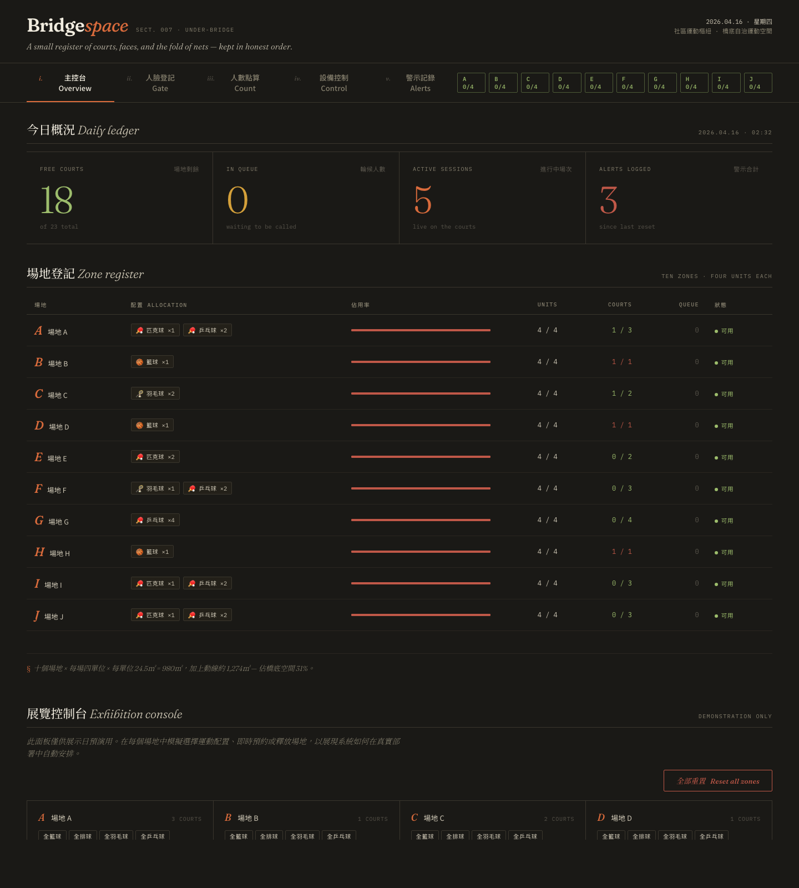
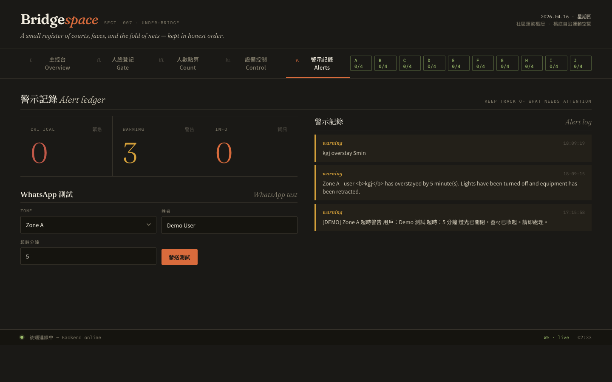
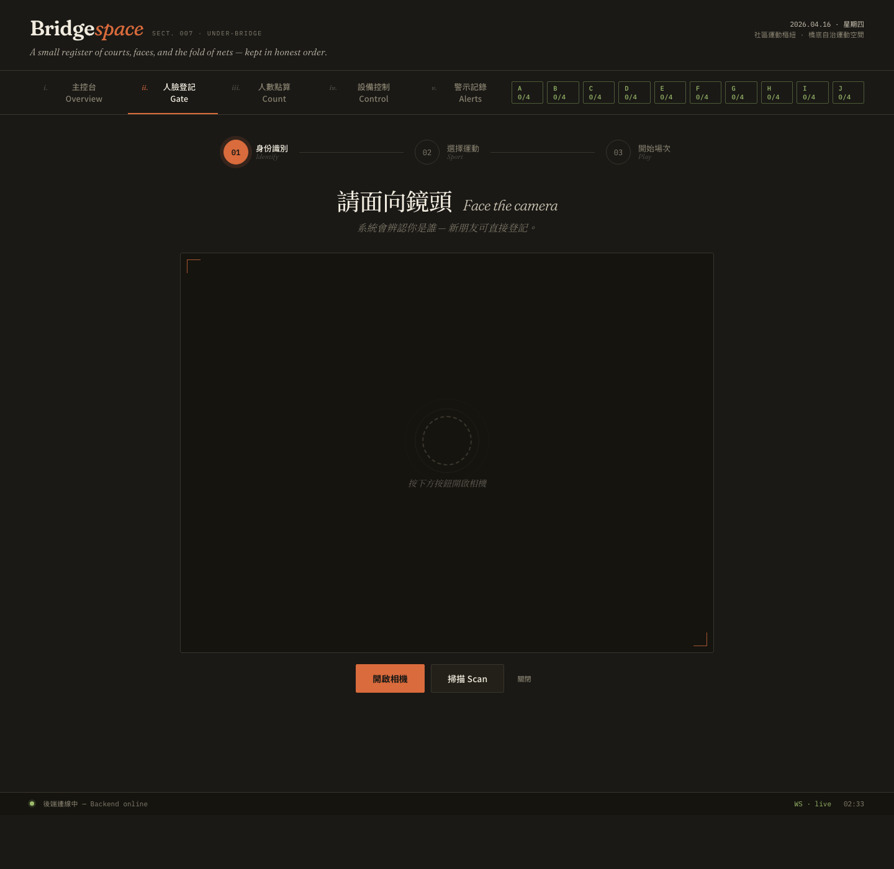
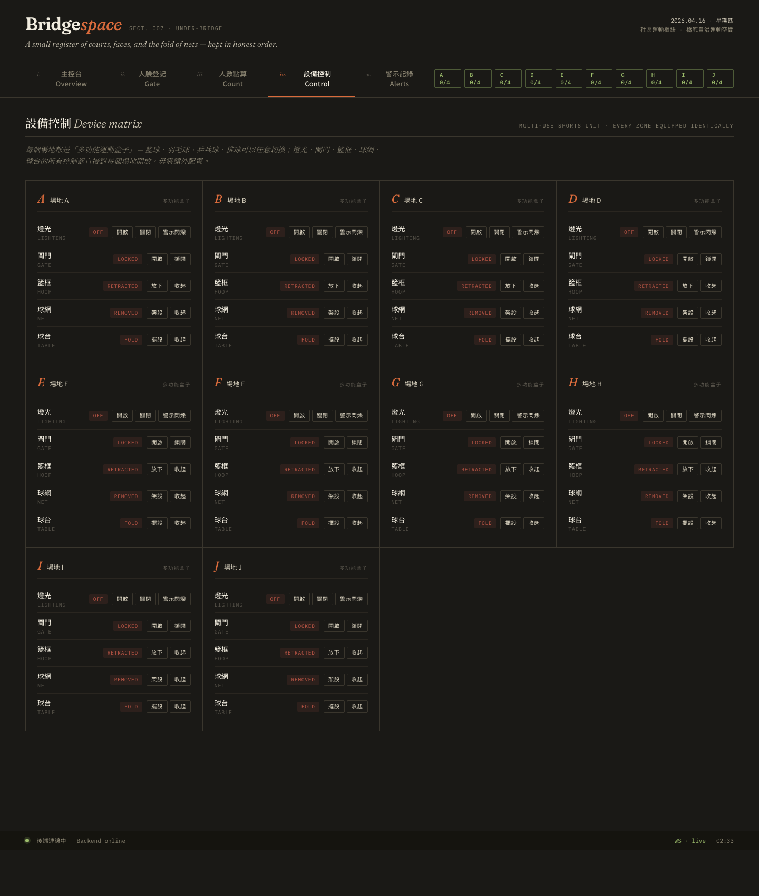

# BridgeSpace v3.1 — Release Notes

**發佈日期**：2026-04-16
**主要 commits**：
- [`9066c4c`](https://github.com/MMARCOO1313/com1002/commit/9066c4c) — `feat: v3.1 editorial redesign + sport-first smart matching + hourly booking rules`
- [`1930618`](https://github.com/MMARCOO1313/com1002/commit/1930618) — `feat: URL hash routing for tab deep links`

本次改動橫跨 4 個檔案、近 5,000 行變動，分為 **4 大主題**：

1. 視覺風格重做（去 AI 感）
2. SmartGate 多步驟 wizard + 運動優先智能匹配
3. SmartControl 多功能運動盒子（所有場地設備統一）
4. 預約規則改寫（1 小時固定 + 每日 2 小時上限 + 最後 10 分鐘延長）

另修復了舊有 `smart_ctrl` 拼字 bug 導致的 500 錯誤。

---

## 1 · 視覺風格重做

### 舊版（cyberpunk HUD）
- Orbitron 未來字體、全 ALL CAPS、// ═ ─ 裝飾符號
- 霓虹青藍色系配大量 glow、scanline overlay、六角網格背景
- 10 個場地以相同 card 並列，HUD corner brackets
- 螢光動畫 shimmer / breathe / glitch

### 新版（editorial civic operations）
- **字體**：`Fraunces`（可變軸襯線，做編輯風）+ `Noto Sans TC / Noto Serif TC`（中文）+ `IBM Plex Mono`（數據）
- **配色**：暖色近黑 `#1a1916` + 陶土橙 `#d96b3c`（顏料色非軟體色），輔以苔綠 / 芥黃 / 磚紅作狀態
- **細節**：極輕的紙紋 overlay、1 px hairline rule、§ 小節符號、i./ii./iii. 羅馬小字
- **佈局**：側邊欄 icon 導航改為水平 section nav；10 個場地改為**登記表格**（更像真實預約簿）

### 截圖：主控台



觀察要點：
- 上方標識 `Bridge` `space` 用 Fraunces italic，陶土橙 `space` 與正色 `Bridge` 形成微對比
- 今日概況用 4 個橫向欄，數字用 Fraunces 超大字襯線體（68 px），Caption 英文中文並列
- 場地登記以 table 呈現，每行 ID 為斜體陶土橙，Allocation 欄位用 monospace 小標
- Footer 左下 `backend online / offline` + 右下時間，都用 mono 小字

### 截圖：警示記錄



`critical / warning / info` 以小寫 italic 顯示（像學術期刊用詞），而不是機器大寫警告字。

---

## 2 · SmartGate 多步驟 wizard + 智能匹配

### 設計問題回應
舊版一頁塞：攝像頭在左、結果 + 登記 + 場地選擇疊在右側。用戶完全不知道流程走到哪。

### 新版：三步 wizard
```
 ①───── ②───── ③
 身份識別  選擇運動  開始場次
```

### 截圖：身份識別步驟



- 攝像頭置中放大（`max-width: 860px`，4:3 比例）
- 進度條：當前步陶土橙發光，已完成步苔綠，未到步灰色
- 攝像頭未開啟時，中央顯示 3 層同心 dashed ring + 提示文字
- 下方三個按鈕：開啟相機（primary 橙）/ 掃描 Scan（外框）/ 關閉（小灰）

### 智能匹配邏輯（`POST /smartgate/match-sport`）
用戶選了運動（例如「羽毛球」），後端執行三層 fallback：

```
① walk-in 可用
   └─ 有場地已配置該運動 + 有空閒球場 + 無人排隊
      → 選 free 最多的 zone，直接開 1 小時場次

② 智能重配（reconfigured）
   └─ 無配置中場地可用，但有完全空閒（無 session、無 queue）的 zone
      → 自動套用「全{運動}」preset（e.g. 全羽毛球 = 2 場羽毛球）
      → 設備自動切換，然後開場次

③ 輪候（queued）
   └─ 都沒空檔
      → 選已配置該運動、隊伍最短的 zone，自動入隊
```

### 運動可用性 API（`GET /smartgate/available-sports`）
每種運動的即時狀態：
```json
{
  "sport": "羽毛球",
  "verdict": "ready",        // 或 "reconfigurable" / "queue_only"
  "walk_in_free": 3,
  "queue_depth": 0,
  "configured_zones": ["A", "C"],
  "empty_zones_available": 2,
  "reconfigurable": false,
  "duration_min": 60
}
```
前端據此在 5 張運動卡右上角貼上三種 ribbon：
- 🟢 **即時可用 X 場**（ready）
- 🟡 **智能重配**（reconfigurable，系統將即時佈置）
- 🟠 **須輪候 #N**（queue_only，前面 N 人）

---

## 3 · SmartControl 多功能運動盒子

### 舊版
每個 zone 根據 allocation 顯示部分設備。例如 zone A 只配了羽毛球，就只顯示 `燈光 / 閘門 / 球網`，`籃框 / 球台` 顯示為 `N/A` 或隱藏。

這不符合物理現實 — 使用者說明書指出 **每個場地物理上都有全部 5 種設備**，隨時可以切換。

### 新版
10 個 zone 全部顯示 **燈光 / 閘門 / 籃框 / 球網 / 球台** 5 種設備的控制按鈕，無論當前 allocation 是什麼運動。

### 後端修改
`backend/smart_control.py`：
- `_init_state()` 初始化時每個 zone 都配齊 5 種設備的 rest state（不再 `n/a`）
- 新增六個單一動作方法：`hoop_deploy/retract`、`net_setup/remove`、`table_setup/fold`

`backend/main.py` `/devices/{zone_id}/{device}/command`：
- 原本只支援 `light / hoop / gate`，現擴展 `net` 與 `table` 的 actions

### 截圖：設備控制矩陣



每個 zone 卡片顯示：
- 左上大寫場地編號（斜體陶土橙）
- 右上 `多功能盒子` 小 badge
- 下方 5 行設備列表，每行有當前狀態 pill（綠 = 啟用 / 紅 = 關閉 / 黃 = 閃爍）+ 行動按鈕

---

## 4 · 預約規則改寫（v3.1 核心）

### 規則定稿
| 規則 | 值 | 實現 |
|---|---|---|
| 每次預約 | 固定 1 小時 | `SESSION_DURATION = 3600` |
| 每人每日預約次數 | 1 次 | `user_has_booking_today()` 檢查 |
| 每人每日 quota | 2 小時 | `MAX_DAILY_MINUTES = 120` |
| 延長時間窗 | 最後 10 分鐘 | `EXTEND_WINDOW = 600` |
| 延長次數 | 最多 1 次 | `MAX_EXTENSIONS = 1` |
| 延長增加 | 1 小時 | `EXTEND_ADD_SECONDS = 3600` |

結果：一次預約最多變成 2 小時（1 h + 1 h 延長），且每人每日只能預約一次 — 要拿到第 2 小時的唯一途徑是**在最後 10 分鐘主動延長**。

### 邏輯中樞：`session_manager.check_booking_quota()`
```python
def check_booking_quota(self, user_id, extra_minutes=None):
    # ① 阻擋：已有進行中場次
    active = self.get_user_active_session(user_id)
    if active:
        return (False, "你已有進行中場次 — 一次只能預約一個場地。")

    # ② 阻擋：今日已 book 過
    if self.user_has_booking_today(user_id):
        return (False, "你今日已預約過一次場次 — 每人每日只可預約一次，"
                       "要多打一小時請於場次最後 10 分鐘選擇延長。")

    # ③ 阻擋：quota 不足
    if used + extra_minutes > MAX_DAILY_MINUTES:
        return (False, f"今日預約額度只剩 {remain} 分鐘...")

    return (True, "", remain)
```

### 延長規則：`session_manager.extend_session()`
拒絕原因（附友善訊息）：
- 已延過一次 → 「每個場次只可延長一次」
- 時間 > 10 分鐘 → 「還有 N 分鐘 — 要在最後 10 分鐘內才可申請延長」
- 時間 < −60 秒 → 「場次已結束，無法再延長」
- quota 不夠 → 「今日預約額度只剩 X 分鐘，不足以延長 60 分鐘」
- 有人在排隊 → 「有 N 人正在輪候此區，為公平起見不能延長」

### 新端點：`GET /smartgate/user/{user_id}`
Wizard 識別用戶後一次拿到所有狀態：
```json
{
  "id": "...", "name": "...", "phone": "...",
  "quota": {
    "max_minutes": 120,
    "used_minutes": 0,
    "remaining_minutes": 120,
    "session_length_minutes": 60,
    "extend_window_minutes": 10,
    "max_extensions": 1,
    "can_book_new": true
  },
  "active_session": null
}
```
若有進行中場次，`active_session` 會帶 `remaining_seconds`、`can_extend`、`extend_unlocks_in_seconds`，供前端做延長按鈕的 state。

### 前端延長按鈕動態解鎖（outcome view 每秒 tick）
```js
function updateOutcomeTick() {
  const remaining = (expires_ms - Date.now()) / 1000;

  const canByTime  = remaining <= 600 && remaining > 0;
  const canByExt   = extended === 0;
  const canByQuota = used + 60 <= max_minutes;

  if (!canByExt)   extendBtn.disabled = true; hint = '此場次已延長過一次';
  if (!canByQuota) extendBtn.disabled = true; hint = '今日預約額度不足';
  if (!canByTime)  extendBtn.disabled = true;
                   hint = `最後 10 分鐘才能延長 — 還要等 ${formatMMSS(remaining - 600)}`;
  else             extendBtn.disabled = false;
                   hint = `剩餘 ${formatMMSS(remaining)} — 現在可以延長一小時`;
}
```
用戶不用猜為什麼按鈕是灰的 — hint 直接說出原因。

---

## 5 · Bug 修復

### `smart_ctrl` NameError → 500 → 假 CORS 錯誤
**症狀**：在展覽控制台點任何 preset（例如「全籃球」）會得到：
```
Access to fetch at 'http://localhost:8000/zones/J/allocate' ...
has been blocked by CORS policy: No 'Access-Control-Allow-Origin' header ...
POST /zones/J/allocate 500 (Internal Server Error)
```

**根本原因**：`backend/main.py` 兩處把 `smart_control`（模組級變數）誤寫為 `smart_ctrl`（不存在）：
- `line 437`：`/zones/{zone_id}/allocate` 內部
- `line 1337`：`/smartgate/match-sport` 的 Tier 2 自動重配

這是 `NameError`，FastAPI 沒經過 exception handler，CORSMiddleware 也沒機會補 header，瀏覽器因此看到誤導性的 CORS 錯誤。

**修復**：兩處改為正確的 `smart_control.update_zone_equipment(...)`。

---

## 6 · URL hash 路由（後加）

順手加入 `#smartgate` / `#smartcontrol` / `#smartcount` / `#alerts` 的 deep-link 支援，便於展覽時從其他資料中直連到特定頁，也讓截圖流程不用手動點擊。

```js
const VALID_HASH_TABS = ['dashboard','smartgate','smartcount','smartcontrol','alerts'];
function applyHashRoute() {
  const h = (location.hash || '').replace('#','').trim();
  if (VALID_HASH_TABS.includes(h)) switchTab(h);
}
window.addEventListener('hashchange', applyHashRoute);
```

---

## 7 · 驗證步驟

### 啟動本機
```bash
cd backend
uvicorn main:app --reload
# 另一視窗
cd /Users/marco/Desktop/COM1002
python3 -m http.server 5500   # 避免 file:// null origin 的雜訊
open http://localhost:5500/dashboard.html
```

### 建議 QA 情境
| 情境 | 預期結果 |
|---|---|
| 新用戶掃臉 → 登記 → 選羽毛球（有配置） | 1 小時場次、延長按鈕鎖定、倒數至最後 10 分鐘解鎖 |
| 新用戶選排球（無場地配置但有空閒 zone） | Tier 2 `reconfigured`：黃色 notice + 系統已切換 zone 配置 |
| 所有場地全滿 → 選任何運動 | Tier 3 `queued`：顯示輪候號、WhatsApp 通知預告 |
| 已有 active session 再掃臉 | 直接進 outcome，顯示「你目前的場次」+ 延長按鈕 |
| 今日已 book 過（已結束）再掃臉 | Welcome 卡顯示「今日已完成一次預約」、CTA disabled、Sport picker 紅色 banner |
| 在最後 10 分鐘按延長 | 場次 +1 小時、按鈕變灰、hint「此場次已延長過一次」 |
| 展覽控制台點任何 preset | 成功切換（先前的 500 bug 已修復） |

---

## 8 · 檔案變動統計

```
backend/main.py            |  364 +++-
backend/session_manager.py |  232 ++-
backend/smart_control.py   |  128 +-
dashboard.html             | 4010 +++++++++++++++++++++++++++-----------------
4 files changed, 3141 insertions(+), 1593 deletions(-)
```

- `backend/main.py`：兩個新端點（`/smartgate/user/{id}` + `/smartgate/match-sport` + `/smartgate/available-sports`）、`smart_ctrl` 拼字修復、`demo/book` quota-bypass、session_manager 回傳 ok-check
- `backend/session_manager.py`：全部 quota 相關常數 + 三個 helper + 改寫 start/extend
- `backend/smart_control.py`：全 zone 設備鋪齊、新增 6 個單一設備動作
- `dashboard.html`：CSS 完整重做、SmartGate wizard HTML/JS 重寫、quota UI、倒數 tick、hash 路由
