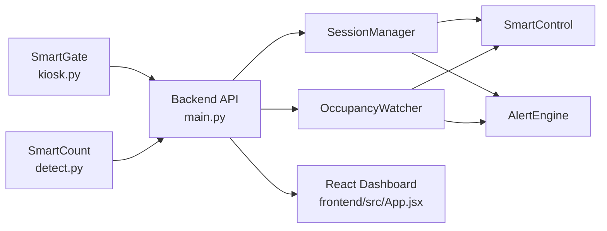
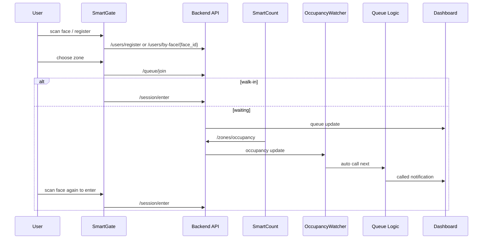

# BridgeSpace V2 Operation Guide

This guide is the operator-facing runbook for the BridgeSpace v2.0 demo. It complements the project overview in `README.md` and focuses on what to start, what to watch, and how the autonomous loop behaves during a live demonstration.

## System Architecture

## Demo Startup Order

Start the system in this order so the dashboard always has a stable backend to connect to.

1. Backend API: `cd backend && python main.py`
2. SmartCount: `cd smartcount && python detect.py --zone A --show`
3. SmartGate kiosk: `cd smartgate && python kiosk.py --api http://localhost:8000`
4. Frontend dashboard: `cd frontend && npm run dev`

If this is the first run on a machine, install dependencies first:

- Backend: `pip install -r backend/requirements.txt`
- SmartGate: `pip install -r smartgate/requirements.txt`
- SmartCount: `pip install -r smartcount/requirements.txt`
- Frontend: `cd frontend && npm install`

## Autonomous Operation Flow

## What the Operator Should Watch

- Backend terminal: session creation, queue advancement, and alert logs.
- SmartCount terminal: occupancy updates and webcam detection stability.
- Kiosk screen: face recognition, queue join, active session timer, and extension flow.
- Dashboard: occupancy bars, queue state, called notifications, session countdowns, device states, and alert banner.

## Key API Contracts

- `POST /queue/join`
  - Input: `user_id`, `zone_id`
  - Output: either `walk_in: true` or a queued ticket
- `POST /session/enter`
  - Input: `face_id`, `zone_id`, optional `queue_id`
  - Output: `session_id`, `expires_at`, `duration_min`
- `POST /session/extend`
  - Input: `session_id`
  - Output: `new_expires`, `extensions_remaining`
- `GET /sessions/active`
  - Output: active sessions with `id`, `user_id`, `zone_id`, `extended`, and `remaining_seconds`

## Demo Scenarios

### Scenario 1: First-time user registration

1. Stand in front of the kiosk camera.
2. Choose first-time registration.
3. Enter name and phone.
4. Select a zone.
5. If the zone is under 50% occupancy and has no waiting queue, the system should allow walk-in immediately.

### Scenario 2: Auto queue advancement

1. Fill a zone so the next user joins the queue.
2. Reduce occupancy in that zone through SmartCount input.
3. Wait for the departure confirmation window.
4. Confirm the dashboard displays the called notification automatically.

### Scenario 3: Session extension

1. Start a session at the kiosk.
2. Re-scan the same user while the session is active.
3. Trigger session extension.
4. Confirm the timer updates and the backend still enforces the max extension rule.

## Troubleshooting

- Kiosk cannot start a session:
  - Check that the kiosk is sending `face_id` to `/session/enter`.
  - Confirm the user exists in `/users/by-face/{face_id}`.
- Session extension fails:
  - Check that the kiosk is using `session_id` with `/session/extend`.
  - Confirm the zone does not have waiting users.
- Dashboard looks offline:
  - Confirm backend is running on port `8000`.
  - Confirm frontend WebSocket URL points to `/ws`.
- No alerts appear:
  - Telegram and Twilio are optional.
  - Even without them, alerts should still be broadcast to the dashboard.

## Recovery Checklist

1. Restart backend if WebSocket events stop.
2. Restart SmartCount if occupancy data freezes.
3. Restart kiosk if the camera feed or face scan stalls.
4. Reload the frontend if the dashboard remains disconnected after backend recovery.
